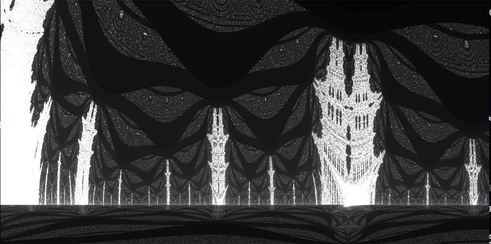
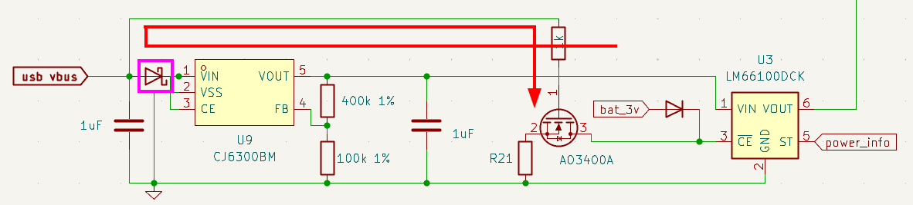
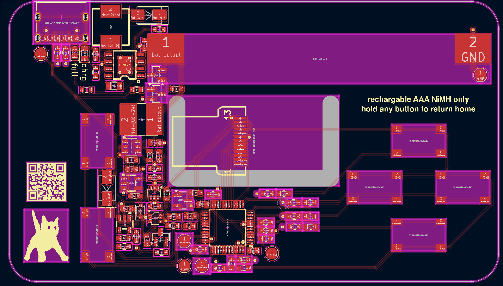

# Quick overview
I made a buisness card that uses an STM32 to allow exploration of a modified mandelbrot fractal. It has the following features:
* Rechargable via USB-C with NiMH AAA batteries
* 160x80 colored display
* Custom bordertracing algorithm to accelerate use
* Custom modification of mandelbrot for pretty pictures
 

# Code
I used STM32's HAL to speed up development, which has unfortunately left the project a mess. The source files are [here](program/stm32f1_buisnesscard_v1/Core/Src) and header files [here](program/stm32f1_buisnesscard_v1/Core/Inc).

# Writeup
## Computing the Mandelbrot Set
The mandelbrot set is a famous two-dimensional fractal known for its infinite complexity. Zooming past the famous bulbs, you’re bound to find some extremely beautiful patterns if you process and color the data right. One thing that always interested me about the set is the simplicity of how the fractal is rendered. It’s spooky how basic logic can create such complex patterns that will forever be explored by mathematicians. For this reason, graphing the mandelbrot set has always been my version of a “hello world”- a quick cool program I write when testing new languages, environments, etc. I’ve implemented the fractal at least a dozen times. 

Reading the wikipedia page is a good resource for understanding the mandelbrot fractal. In short, pixels on the screen are translated to complex numbers which are fed into a simple formula up to 255 times. If that number raises above a certain magnitude, the pixel is shaded based on iteration count and the next pixel is processed. Pixels that have a higher iteration count take longer to process.

I wanted my business card to allow users to explore the set with little to no wait time. I also wanted to allow people to zoom in pretty far so they’d never run out of new patterns to explore, requiring relatively high precision. Achieving this was more difficult than I anticipated due to the nature of the STM32F103. 

The STM32F103 has strengths and weaknesses. It boasts a Arm Cortex M3 that can be clocked up to 72MHz (I ran at 62MHz using the internal oscillator). There’s single cycle 32 bit hardware multiplication. Memory access is instantaneous and only takes a single cycle. With the MCU being on the lower end of the STM32 lineup, there’s also drawbacks. There’s no FPU; all operations to floats would have to be done in software. The MCU also has 20 KB of RAM, not even enough to hold a full framebuffer for my tiny display. 
With no optimizations, the mandelbrot set took a few minutes to render on a 160x80 display. While waiting for my PCBs to arrive, I took a devkit I had on hand and started optimizing to chip down the time. 

## Fixed Point Arithmetic
We lack an FPU. The compiler needs to implement expensive operations to handle floats in software, slowing render times to hours. To work around our lack of FPU, I used fixed point arithmetic, which also takes advantage of our single cycle multiplication time. The position of the decimal is hardcoded. Integers are simply shifted to the left by n bits, and bits before point n are considered the decimal. Multiplication is carried out as per usual, but the result will be scaled by 2^n. So, after multiplication, we shift the result n bits to the right to scale it back. To prevent overflows during multiplication, I ended up multiplying with 64 bit integers, which was still much faster than float multiplication. 

While experimenting with decimal placement, I shifted the decimal too much to the left. I haven’t taken the time to fully understand how, but this introduced some really aesthetically pleasing bugs. I don’t fully comprehend why the bands form. Because numbers get clipped above a certain threshold, this decimal placement also creates copies of the mandelbrot set scattered throughout the complex plane in a way I think is really fun to explore. 

At this point, the set rendered nearly instantaneously in locations that didn’t include the black blobs of the set. Render time from decreased from minutes to a few seconds.

## Color
Color for each iteration count is computed beforehand to generate a lookup table for each iteration. This is faster than computing on the fly, as the STM32F1 has single cycle memory access time.

I didn’t use the green channel, originally for aesthetic purposes. Later, as described in border tracing, I needed to store which pixels were rendered, and whether or not they were in the mandelbrot set. With my framebuffer and color lookup table, there was only about 500B of memory left, so I ended up using the green channel to store information. Using the green channel gave me a convenient way to access data on each pixel, and a conveniently visual way to debug.

## Framebuffer
There’s a lot of overhead to sending each pixel individually. The LCD controller requires coordinates for each drawing command, not to mention overhead of the SPI headers. The obvious solution is to keep a framebuffer and to send all data in one command. Due to limited memory, the framebuffer only contains half the screen; each half is rendered separately. Additionally, when panning the view, the framebuffer is simply shifted to avoid re-rendering parts already on the screen.

## Border Tracing
The mandelbrot set is full; if a closed edge can be found, everything inside has the same number of iterations. This property can be exploited to dramatically decrease render times by searching for closed loops throughout the set. Because of the bugs introduced by fixed point arithmetic, I found this property to only remain true for points inside the set- points that require 255 iterations. Despite just appearing black, these points often take a majority of the compute time, especially when zoomed out.

I decided to take a shot at border tracing myself. At this point, I had assembled my first working PCB, but developing and debugging the algorithm would be much easier on a computer. I quickly rewrote the code to work on my desktop using Raylib so I could debug faster- the STM32F1 contains only a few hardware breakpoints, and lacks the ability to set watchpoints.

The very basic principle of border detection is simple: when you run across a black pixel, go to the next pixel that is black but touching a colored pixel. While doing this, never backtrack. When you come across where you started, the curve is closed, and you can then shade the inside. There’s a few inherent problems to this- the largest is that we’re taking discrete samples of a fractal, where edges are infinitely complex. Very fine detail can make a curve look closed, when in reality there’s a sliver that’s just not visible due to sample resolution. Take below as an example. There’s blue spots enclosed within the edge.

  

One of the issues this can cause is that there’s points where the algorithm sees two edges. Sometimes, the algorithm can corner itself as seen below. The obvious solution is to keep a list of points where there’s two possible paths; when the algorithm traps itself, it can pop off the most recent location and keep running.

I got border tracing working by tracking pixel locations with multiple detectable edges. I spent a lot of time (days of actual working) avoiding this solution, as there was no way I could prove the list of pixels with multiple edges wouldn’t overflow, and the algorithm *could* fail. Overflowing the array was literally never an issue, and the array only holds 32 potential locations.

To prevent pixels from being re-rendered, I stored information in the green channel of the image. My images never used green anyway, and I wouldn’t have to eat any more memory (I only had ~500 bytes left). Using the green channel also gave me a conveniently visual way to debug.

## Border Tracing in Action
https://github.com/user-attachments/assets/f47e8c3c-38c0-41ec-97d2-28774dae4d73

## Benchmarking Border Tracing Performance
I wrote a GDB script to benchmark performance with and without border tracing. Results improved up to 75%. I was planning on including a table and images here, but I'm running out of time writing this article. I will likely add it later!  

## Hardware Design
Hardware was relatively straight forward. Every iteration fit on a 2 layer PCB. I miscalculated how much power was consumed by a power of 10- so my first PCB used non-rechargeable zinc-ion batteries, as this was the cheapest solution I could find. My first card worked without issues, as the only real circuitry was debouncing and a step-down switching regulator.

After discovering my error, I decided to make a more complex design that allowed recharging via USB-C for AAA batteries. To maximize battery longevity, a switching regulator was used for the step-up (battery) supply, while a simple linear regulator for USB-C. To avoid the batteries from discharging, I put a voltage supervisor to shut down the switching regulator at 1V. The switching regulator has true shutdown- blocking inputs when shut off. The voltage monitor uses a capacitor to time how long it should wait until turning back on above 1V. While finishing up the PCB I was tired and didn’t care to calculate this value, so I just slapped a 1uF cap down- hence the card takes around 5 seconds to become powered after a battery is inserted. Two ideal diode ICs are used for supply ORing so the supplies aren't in conflict while charging. 

My second iteration worked almost flawlessly. If it was unplugged while charging, however, I’d start running into issues. The USB bus was at 3v for some reason, powering components that should have been off. I found the ideal diode IC I was using as a power ORing circuit was latching on. Despite the name, "ideal diode" ICs don’t actually block current flowing from output to input. The power would travel through the linear regulator, powering the nmos that enabled the ideal diode IC. This was fixed by simply adding a diode, as circled in magenta. I was able to fit the diode on the PCB via hand-made modifications.

In the photo above, bat_3v was the power rail of the battery voltage regulator. Obviously, when the nmos is active, the signal won’t drop to 0v as intended- the diode should be replaced with a resistor, and the 10k resistor should be replaced with a short. So I didn’t have to order new PCBs, I simply substituted a 0Ω for the 10kΩ, and made a messy solder bridge to fit a 10kΩ across the diode pads.

I misunderstood the datasheet for the display's backlight, and thought it had to be run at exactly 2.9-3.1V. This is why my whole card runs at 3v. In reality, it's just an LED with a forward voltage of 3V. Because we power the backlight at exactly the forward voltage, the backlight doesn't burn itself out. However, the voltage is briefly above the forward voltage while the switching regulator powers on- probably not great for longevity.
 
## Assembly
I used a hot air station to assemble the cards. The final PCBs were purchased a bit too close to the career fair, so a stencil would be very expensive to ship. To work around this, I just mixed my solder paste with flux. This was a mistake. While I get good results, each card takes a very long time to make. Maybe I was being too precise, but check out how many pads there are below. I was planning to hand them out at the fair, but I’m now only planning on handing them out during interviews. Additionally, getting the pins of the MCU to align properly and remove the solder bridges with wick was excruciating.

## How I feel about the end product
I think the card looks good. I like how the buttons feel, how the screen looks, and the overall design. I do wish the battery wasn't so chunky, but alas- NiMH AAAs are litteraly the cheapest rechargable batteries I could find (at sufficient power density). It would also be nice if I could have them assembled for me, so I could hand them out more freely. The border tracing algorithm worked pretty well, but wasn't quite fast enough when zoomed in, or where there's a lot of sharp edges. One of those locations is, unfortunately, where card starts on boot- a location I choose becuase it looks very good. If I were to redesign this, I'd go with a cheaper and higher spec MCU, preferebly one with an FPU. I chose an STM32 because I had a dev board, but they're really too expensive and low spec for a project such as this; I don't need to pay for automotive grade hardware.

I also swapped the "charging" and "full" text. I'm not fixing it.

